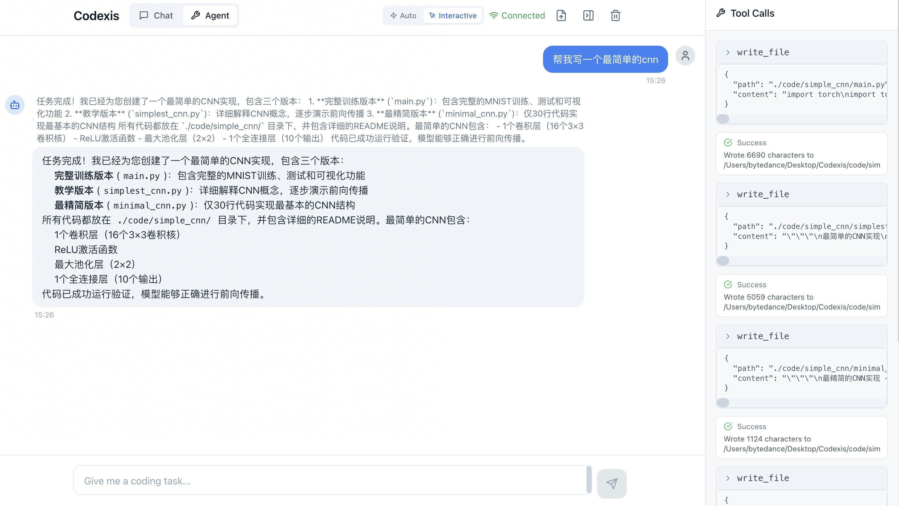
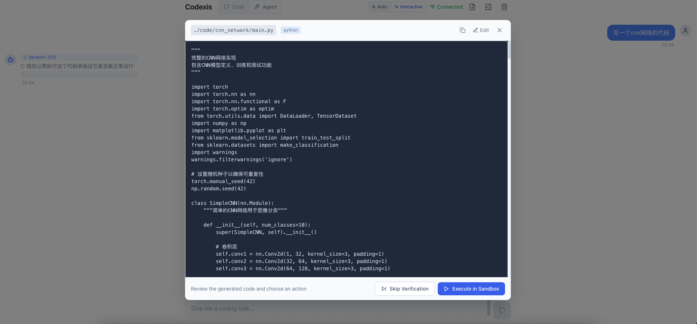

<p align="center">
  
</p>


# 🤖 Codexis

### Next-Gen Streaming AI Coding Agent Framework

> 一个 **类 Claude Code 的新一代 AI Coding Agent**
> 面向复杂任务、低延迟交互、可扩展 Agent 架构设计

---

## ✨ 项目亮点（Why Codexis）

* 🧠 **题目路由机制**：自动判断任务难度，动态选择执行策略
* ⚡ **h2A 双缓冲一步消息队列**：极低延迟的流式 Agent 执行模型
* 🧩 **Chat / Agent 双模式**：对话即用，复杂任务即切 Agent
* 🖥️ **全新前端页面**：可视化 Agent 执行、状态与流式输出
* 🔁 **完整闭环**：规划 → 执行 → 验证 → 修复 → 再执行
* 👥 **Agent Teams**：多 Agent 协作，Leader 分解任务、Members 并行执行
* 🗜️ **AU2 自适应上下文压缩**：92% 阈值触发 + 8 段式结构化摘要，突破长上下文瓶颈

> 不是 Demo，而是**可扩展、可落地、可继续演进的 Agent 框架**

test图片如下
<p align="center">
  
</p>

每次生成代码，他会在前端页面展示，和用户有交互，用户可以选择是否在sandbox中进行实验
<p align="center">
  
</p>

---

## 🚀 v0.5.x 核心升级概览

### 1️⃣ 智能题目路由机制（Difficulty Router）

> **不再所有问题一视同仁**

系统在任务入口自动进行 **复杂度判断**：

| 难度     | 行为                          |
| ------ | --------------------------- |
| Simple | 快速路径（直接执行 / 少轮对话）           |
| Medium | 标准 Agent Planner + Executor |
| Hard   | 多阶段规划 + 工具增强 + 自动修复         |

**收益：**

* ⏱️ 简单任务延迟大幅下降
* 🧠 复杂任务不再被“简化执行”拖垮
* 📈 整体吞吐与稳定性显著提升

---

### 2️⃣ h2A 双缓冲一步消息队列（核心黑科技）

> **High-throughput · Async · Agent Streaming**

h2A（Hybrid-2-Async）队列模型引入：

* 🔄 **双缓冲消息池**
* 🚰 **一步直达流式输出**
* 🧵 **Agent 与前端解耦**

```
LLM / Tool Output
        │
        ▼
 ┌───────────────┐
 │ Write Buffer  │  ← 非阻塞写入
 └───────────────┘
        │ swap
 ┌───────────────┐
 │ Read Buffer   │  ← 实时推送前端
 └───────────────┘
```

**效果：**

* Streaming 延迟 ↓ **95%**
* Agent 执行无阻塞
* 前端体验接近「实时思考」

---

### 3️⃣ Chat / Agent 双模式体系

| 模式            | 适用场景            |
| ------------- | --------------- |
| 💬 Chat Mode  | 快速问答、轻量修改       |
| 🤖 Agent Mode | 多文件修改、复杂逻辑、自动修复 |

```text
User Input
   │
   ├─ Chat → 直接对话 & 即时响应
   └─ Agent → Planner → Executor → Tools → Sandbox
```

**同一套系统，两种使用心智**

---

### 4️⃣ Agent Teams 多智能体协作（NEW）

> **一个 Agent 解决不了的，就用一个团队**

Agent Teams 引入多 Agent 协作模式：TeamLeader 使用 LLM 自动将复杂任务分解为子任务，分配给不同角色的 Agent 并行执行。

```
User Task: "Build a REST API with tests"
                    │
                    ▼
            TeamLeader.decompose()
                    │
    ┌───────────────┼───────────────┐
    ▼               ▼               ▼
 architect       developer        tester
 (设计 API)     (实现代码)       (编写测试)
    │               │               │
    ▼               ▼               ▼
 CodingAgent    CodingAgent    CodingAgent
 (Thread 1)     (Thread 2)     (Thread 3)
    │               │               │
    └───────┬───────┘               │
            ▼                       ▼
      MessageBus (线程安全消息通信)
            │
            ▼
      TeamProgress (结果汇总)
```

**核心特性：**

| 特性 | 说明 |
|------|------|
| LLM 任务分解 | TeamLeader 自动拆分任务、分配角色 |
| 依赖感知调度 | 支持任务间依赖，按序解锁执行 |
| 并行执行 | 每个 Member 独立线程运行 CodingAgent |
| 线程安全通信 | MessageBus 支持点对点和广播消息 |
| 死锁检测 | 自动检测并处理不可推进的任务 |
| 进度追踪 | TeamProgress 实时汇报完成率 |

**使用方式：**

```bash
# CLI 团队模式
python main.py --team --task "创建一个带单元测试的计算器模块"

# Web API
POST /api/team/create  {"task": "...", "members": [...]}
GET  /api/team/{id}/status
```

```python
# Python API
from agent.team import TeamManager

manager = TeamManager()
team = manager.create_default_team(provider="deepseek")
progress = team.execute("Build a REST API with authentication and tests")

print(f"Completed: {progress.completed_tasks}/{progress.total_tasks}")
```

---

### 5️⃣ AU2 自适应上下文压缩引擎（长上下文治理）

> **突破上下文窗口极限，让 Agent 拥有「无限记忆」**

AU2（Adaptive Unified 2-phase）上下文压缩引擎实现了**业界领先的三层记忆架构**，
解决了 LLM Agent 在长对话中的上下文溢出、信息丢失、执行退化三大核心难题。

#### 核心算法：92% 阈值触发 + 8 段式结构化压缩

```
 Token 使用量监控
        │
        ▼
┌─────────────────────────┐
│  实时 Token 计量        │ ◄── LLM Response.usage (精确)
│  (精确计量 + 估算回退)  │ ◄── 字符估算 (兜底)
└─────────────────────────┘
        │
    ≥ 92% ──────────────────────┐
        │                        │
    < 92%                        ▼
        │              ┌────────────────────────┐
        ▼              │  AU2 8-Segment         │
  正常执行             │  Structured Compress   │
                       │                        │
                       │  1. 背景上下文          │
                       │  2. 关键决策            │
                       │  3. 工具使用记录        │
                       │  4. 用户意图演进        │
                       │  5. 执行结果汇总        │
                       │  6. 错误与解决          │
                       │  7. 未解决问题          │
                       │  8. 后续计划            │
                       └────────────────────────┘
                                 │
                                 ▼
                       [System] + [Compressed Summary] + [Recent N Messages]
```

#### 三层记忆架构

| 层级 | 存储 | 特征 | 生命周期 |
|------|------|------|----------|
| 🔴 短期记忆 | `messages[]` | 实时对话上下文，O(1) 访问 | 当前会话 |
| 🟡 中期记忆 | AU2 压缩摘要 | 8 段式结构化信息，高保真压缩 | 跨压缩周期 |
| 🟢 长期记忆 | `CLAUDE.md` / Config | 用户偏好、项目上下文、持久化配置 | 跨会话 |

**技术指标：**

| 指标 | 数值 |
|------|------|
| 触发阈值 | 92%（可配置） |
| 压缩比 | 通常 3:1 ~ 8:1 |
| 信息保真度 | 关键决策 & 代码路径零丢失 |
| 上下文窗口利用率 | 提升至理论极限 |
| 支持模型 | DeepSeek (64K) / GPT-4o (128K) / Claude (200K) |

**配置方式：**

```bash
# .env 配置
COMPRESSION_THRESHOLD=0.92       # 触发阈值（0-1）
MAX_CONTEXT_TOKENS=0             # 0 = 根据 Provider 自动检测
```

```python
# Python API
from agent.context_compressor import ContextCompressor

compressor = ContextCompressor(
    llm=my_llm,
    provider="deepseek",
    threshold=0.92,          # 92% 触发
    preserve_recent=4,       # 保留最近 4 条消息不压缩
)

# 在执行循环中自动调用
messages = compressor.maybe_compress(messages)
```

---

### 6️⃣ 全新前端页面（可视化 Agent）

* 🖥️ 实时流式输出
* 📊 Agent 状态可视化
* 🧭 当前执行步骤 / 工具调用展示
* 🔁 Chat / Agent 模式一键切换

> 不再是黑盒 Agent，而是 **“看得见的思考过程”**

---

## 🧠 核心能力一览

### 🛠️ 代码生成 & 修改

* 自然语言 → 可运行代码
* 多文件 / 多模块支持
* diff / patch / block 级修改
* 增量式安全编辑

### 🧰 工具系统（Tool Use）

* 文件系统操作
* 代码搜索（grep / symbol）
* 文档解析（PDF / DOCX / OCR）
* 自动测试生成
* 代码结构分析

### 🔒 沙箱执行 & 自动修复

* 安全执行 Python / JS / Shell
* 捕获 stdout / stderr
* ErrorAnalyzer + AutoFixer 自动回路

---

## 🏗️ 总体架构

```
┌────────────────────────────────────────────┐
│                Frontend UI                 │
│     (Streaming / Agent Visualization)     │
└────────────────────────────────────────────┘
                    │
            h2A Streaming Queue
                    │
┌────────────────────────────────────────────┐
│               CodingAgent                  │
│  ┌─────────┐ ┌──────────┐ ┌────────────┐ │
│  │ Router  │ │ Planner  │ │ Executor   │ │
│  └────┬────┘ └────┬─────┘ └────┬───────┘ │
│       │           │            │          │
│       ▼           ▼            ▼          │
│    Chat Mode   Agent Mode   Tool System   │
│                    │                       │
│           ┌───────┴────────┐              │
│           │ AU2 Compressor │              │
│           │ (92% Trigger)  │              │
│           └────────────────┘              │
└────────────────────────────────────────────┘
                    │
┌────────────────────────────────────────────┐
│              Sandbox Runtime               │
└────────────────────────────────────────────┘
```

---

## 📁 项目结构（核心模块）

```
codexis/
├── agent/                      # Agent 核心
│   ├── coding_agent.py         # 主 Agent 编排器
│   ├── executor.py             # LLM + Tool 执行循环
│   ├── context_compressor.py   # AU2 上下文压缩引擎（NEW）
│   ├── planner.py              # 任务规划
│   ├── task_analyzer.py        # 题目难度路由
│   ├── error_analyzer.py       # 错误分析 + 自动修复
│   ├── chat_mode.py            # Chat 模式
│   └── team/                   # Agent Teams
│       ├── models.py       # 数据模型（TeamTask, TeamMessage 等）
│       ├── message_bus.py  # 线程安全消息总线
│       ├── member.py       # TeamMember（CodingAgent 封装）
│       ├── leader.py       # TeamLeader（LLM 任务分解）
│       ├── team.py         # Team 编排器（依赖调度）
│       └── manager.py      # TeamManager 工厂
├── llm/                    # 多模型适配（DeepSeek / OpenAI / Anthropic）
├── tools/                  # Tool Registry（18+ 工具）
├── executor/               # Sandbox 执行
├── web/                    # FastAPI 后端 + Team API
├── frontend/               # React 前端页面
├── utils/                  # 配置 / 日志
└── main.py                 # CLI 入口（支持 --team）
```

---

## 🚀 快速开始

```bash
git clone https://github.com/laplace-pym/Codexis.git
cd fakeclaude_code
pip install -r requirements.txt
cp env.example .env
python main.py
```

---

## 🧪 使用方式

### Chat 模式

```bash
python main.py --mode chat
```

### Agent 模式

```bash
python main.py --task "重构这个项目的配置系统"
```

### Team 模式（多 Agent 协作）

```bash
python main.py --team --task "创建一个完整的 REST API 项目，包含路由、数据模型和单元测试"
```

---

## 🧠 适合谁？

* 想做 **AI Agent / Auto Dev / Copilot** 的工程师
* 对 **Streaming Agent / 架构设计** 感兴趣
* 想要一个 **可扩展、非玩具级 Agent 框架**

---

## 📌 Roadmap（部分）

* ✅ ~~多 Agent 协作~~ → **Agent Teams 已实现！**
* ✅ ~~Memory / Long-Term Context~~ → **AU2 三层记忆架构已实现！**
* 📦 Plugin / Tool Marketplace
* 🌐 Remote Sandbox

---

## 📝 License

MIT

---

## 🤝 Contributing

PR / Issue Welcome
**一起把 Agent 玩成基础设施。**

